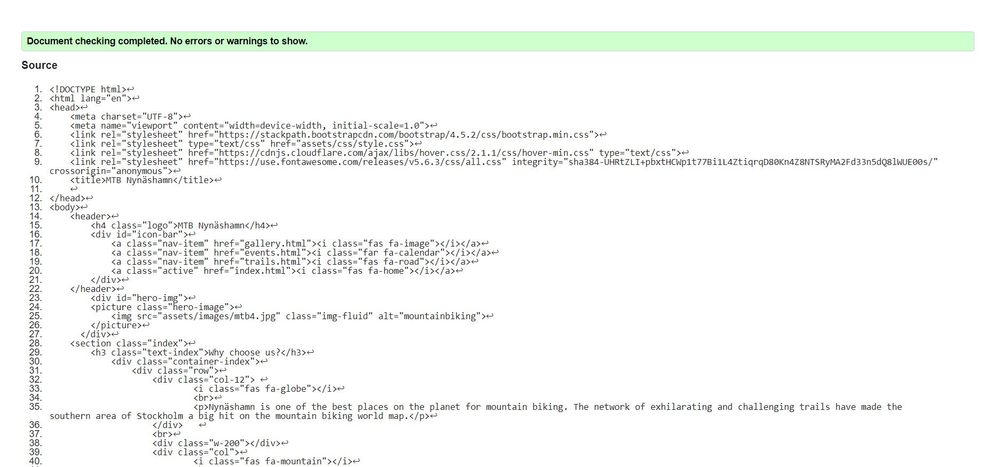
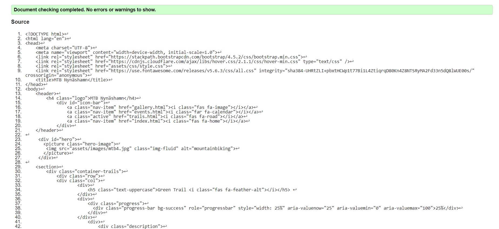
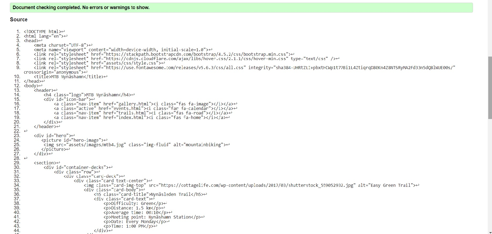
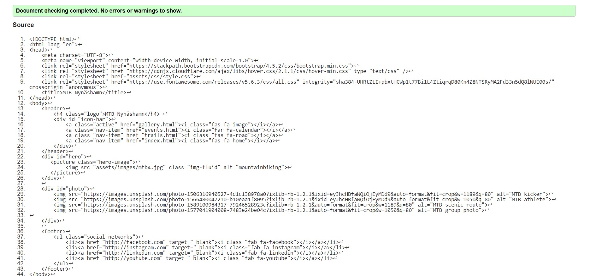
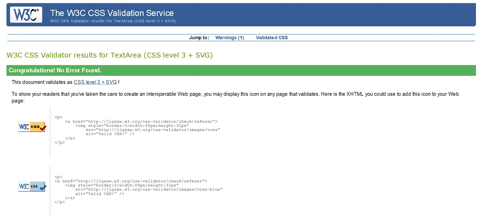

# **MTB Nynäshamn**

Even though the number of cyclists has grown exponentially over the past 4 years, Nynäshamn still lacks a community of cyclists that is brought together by the love of this sport and the willingness to explore the Swedish nature in a different manner.

The main purpose of this website is to form a MTB community in the city of Nynäshamn, in the southern region of the Stockholm Metropolitan Area. 

The website mostly targets beginners of different ages and backgrounds. Hence, the code of conduct (which also serves as a reminder for the intermediate or advanced users), necessary equipment and the trails graded by colours with the suitable explanations. 

Needless to say, everyone is welcome to our MTB sessions, as long as they have a bike with sound brakes, a helmet and a wish to join a lovely community. 

## **User Experience (UX)**

* ### **User Stories**
    * **Visitor Goals**

        a. As a mountain biking beginner, I want to use the site for information regarding the equipment I will be needing, the rules I must follow and the types of trails I will be visiting.  

        b. As a person who has recently moved to the area, I want to use the site in order to pick up a new hobby, join the community and get to know the area where I am living. 

        c. As a parent, I want to use the site to join the events and get in shape, while also spending quality time with my kids/family. 

* ### **Design**

    * **Colour Scheme**
        
        The two main colours used are dark grey and yellow green/moderate yellow.
        
        Color scheme taken from [Colourco](https://colourco.de/) .

    * **Typography**
        
        The two main fonts used are Oswald (headers) and Roboto (body), with Sans Serif as a fallback.

* ### **Wireframes**

    * [Balsamiq Wireframe](https://balsamiq.cloud/sf5gm9p/p2ywraq/r2C91)

## **Features**

* ### **Existing Features**
    * Feature 1 - [Home Page](index.html) - allows the user to get familiar with the scope of the site; 
    * Feature 2 - [Trails](trails.html) - introduces the user to the types of trails available in the area;
    * Feature 3 - [Events](events.html) - presents the events that will take place in the near future;
    * Feature 4 - [Gallery](gallery.html) - showcases images from the scenic routes;
 

* ### **Features Left to Implement**
    * Sign In/Up form

## **Technologies Used**

* ### **Languages Used**

    * [HTML5](https://en.wikipedia.org/wiki/HTML5)

    * [CSS3](https://en.wikipedia.org/wiki/CSS)

* ### **Frameworks, Libraries & Programs Used**

    * [Bootstrap v4.4.1](https://getbootstrap.com/docs/4.4/getting-started/download/)

    * [Google Fonts](https://fonts.google.com/)

    * [Font Awesome](https://fontawesome.com/)

    * [Hover.css](https://ianlunn.github.io/Hover/)

    * [Gitpod](https://gitpod.io/)

    * [GitHub](https://github.com/)

    * [Balsamiq](https://balsamiq.com/)

## **Testing**

* ### **Testing**

    * The W3C Markup Validator and W3C CSS Validator Services were used to validate every page of the project to ensure there were no syntax errors in the project.
    
            W3C Markup Validator - Results

    
        
    
        
    
        
    

        Jigsaw CSS Validator - Results

    

* ### **Automated Testing**
    For the automated testing, I have used [Lighthouse](https://developers.google.com/web/tools/lighthouse). 
    Results can be found in the **Testing** Folder. 

* ### **Testing User Stories from User Experience (UX) Section**

  Upon entering the site, users are automatically greeted with the logo (which is self explanatory) and an easily understandable icon bar to go to the page of their choice.
        
  On each page, besides the logo and the icon bar, the users can see the hero image and a body which contains a structured layout that conveys the purpose of the site, general rules, equipment and a gallery.
        
  At the bottom of each page, the user will find the social icons, which will redirect him/her to the appropriate social media accounts, where he/she will find the necessary contact information and daily updates.
  
  The site is responsive, so the user will have the possibility of viewing the information on smaller devices, such as mobiles or tablets.

  a) As a mountain biking beginner, I want to use the site for information regarding the equipment I will be needing, the rules I must follow and the types of trails I will be visiting. 

    1. The user will be able to access the site and find relevant information regarding the purpose of the site on the home page, along with information regarding the equipment that will be needed for the advertised activity. 
              
    2. On the second page, the user will see information regarding trail types, difficulty and a code of conduct aimed at beginners and not only. 

    3. On the third page, the user will see the schedule for future events. Events are organized weekly (Monday-Saturday) and every event is graded by color of the trail (green, blue, red, black)   

       
  b. As a person who has recently moved to the area, I want to use the site in order to pick up a new hobby, join the community and get to know the area where I am living. 

    1. The user will be able to access the site and find information about MTB and the MTB community here in Nynäshamn, which hopefully will make him/her want to join or at least trigger the desire of joining. 
    
    2. By accessing the social links, the user will have the possibility of checking out the social media accounts, which contain videos, images and daily updates of the community.

  c. As a parent, I want to use the site to join the events and get in shape, while also spending quality time with my kids/family. 
    
    1. The user will be able to use the site to find out when and where the events are generally taking place, if there are any updates on the social media platforms or on the site and retain information about the rules and equipment for the children and for him/herself. 

* ### **Further Testing**

    * The Website was tested on Google Chrome, Microsoft Edge and Opera browsers.

    * The website was viewed on a variety of devices such as Laptop, Huawei P30 Pro, Huawei P20 Pro and Samsung S9.
    
    * A large amount of testing was done to ensure that all pages were linking correctly.
    
    * Friends (Toth Csaba, Carla Barzacovschi, Victor Dobre and Vlad Mălureanu) were asked to review the site and documentation to point out any bugs and/or user experience issues.

* ### **Fixed Bugs**

    * Images not loading in events.html (cards) and index.html. Fixed by using external links.

* ###   **Known Bugs** 

    * On some mobile devices with smaller resolutions(320px), the audio in the Gallery doesn't center, pushing the right margin. As such, a white gap can be seen on the right side of the page. 

## **Deployment**

The project was deployed to GitHub Pages using the following steps:

 1. Log in to GitHub and locate the GitHub Repository.

2. At the top of the Repository (not top of page), locate the "Settings" Button on the menu.

3. Alternatively Click Here for a GIF demonstrating the process starting from Step 2.

4. Scroll down the Settings page until you locate the "GitHub Pages" Section.

5. Under "Source", click the dropdown called "None" and select "Master Branch".

6. The page will automatically refresh.

7. Scroll back down through the page to locate the now published site link in the "GitHub Pages" section.

## **Credits**

* ### **Content**

    * Part of information found on the home page and trail page was copied from [Forestry and Land Scotland](https://forestryandland.gov.scot/visit/activities/mountain-biking).
    * Part of information found on the home page and trails page was copied from [MTB Weekly](https://mtbweekly.com/how-to-find-mountain-biking-trails-for-beginners/).
    * The information found on the events page was taken from [Trailforks](https://www.trailforks.com/region/nynashamn/).

* ### **Media**

    * The full-screen hero image was obtained from [Shutterstock](https://www.shutterstock.com/image-photo/sport-cyclist-on-bike-mountain-forest-743501650).
    * The circle cover image was obtained from [SCOTT Sports](https://www.scott-sports.com/in/en/).
    * The first card image from the [Events Page](events.html) was obtained from [Cottage Life](https://cottagelife.com/wp-content/uploads/2017/03/shutterstock_559052932.jpg).
    * The second card image from the [Events Page](events.html) was obtained from [Roanoke Mountain Biking](https://assets.simpleviewinc.com/simpleview/image/upload/c_fill,h_444,q_75,w_654/v1/clients/roanoke/Roanoke-Mountain-Biking_ac0a77df-8b4b-4fbd-a0d5-5a2ceb7d3d44.jpg).
    * The third card image from the [Events Page](events.html) was obtained from [The Green Trails](https://www.thegreentrails.com/wp-content/uploads/2015/03/rezdy-profile.jpg).
    * The fourth card image from the [Events Page](events.html) was obtained from [Google Images](https://hips.hearstapps.com/hmg-prod.s3.amazonaws.com/images/mg-4841-1597155372.jpg).
    * The fifth card image from the [Events Page](events.html) was obtained from [303 Magazine](https://images.303magazine.com/uploads/2017/06/verde-2.jpg).
    * The images from the [Gallery Page](gallery.html) were obtained from [Unsplash](https://unsplash.com/s/photos/mountain-bike).

### **Acknowledgements**
I received inspiration for this project from the [Love Running Project](https://courses.codeinstitute.net/courses/course-v1:CodeInstitute+CF101+2017_T1/courseware/1f0ccaac7a3e43d895c1beae5363f46c/8b3e9adaef764e1d962a85668c799cdd/?activate_block_id=block-v1%3ACodeInstitute%2BCF101%2B2017_T1%2Btype%40sequential%2Bblock%408b3e9adaef764e1d962a85668c799cdd) featured at the end of the HTML/CSS module and the [Whiskey Drop Project](https://courses.codeinstitute.net/courses/course-v1:codeinstitute+FE+2017_T3/courseware/a4b90d17e5c94220a0f83f00ce7fa606/2aca2c94a518427495cc1b4bc641ccbf/?child=first) and [Resume Project](https://courses.codeinstitute.net/courses/course-v1:codeinstitute+FE+2017_T3/courseware/616289d66b5641a3808cc43e53842695/36e3366dbdaf40fd852994c51f9f8595/?activate_block_id=block-v1%3Acodeinstitute%2BFE%2B2017_T3%2Btype%40sequential%2Bblock%4036e3366dbdaf40fd852994c51f9f8595) featured in the User Centric Fronted Development module. 

Inpiration for the README.md came from [Awkale.me](http://awkale.me/user-story-best-practice/), [Markdown Tutorial](https://commonmark.org/help/tutorial/), [Code Institute Solutions](https://github.com/Code-Institute-Solutions/SampleREADME)/[Anna Greaves](https://www.youtube.com/watch?v=7BteidgLAyM&amp;feature=youtu.be). 

Last, but not least, I would like to thank my mentor, Mark Railton, for helping me get through this challening first milestone project. 